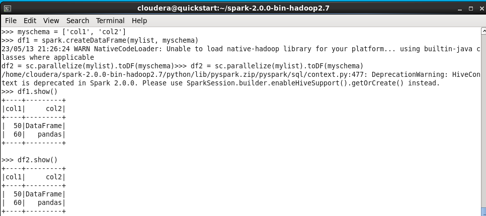
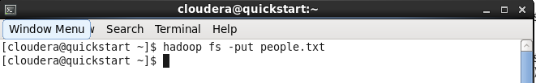
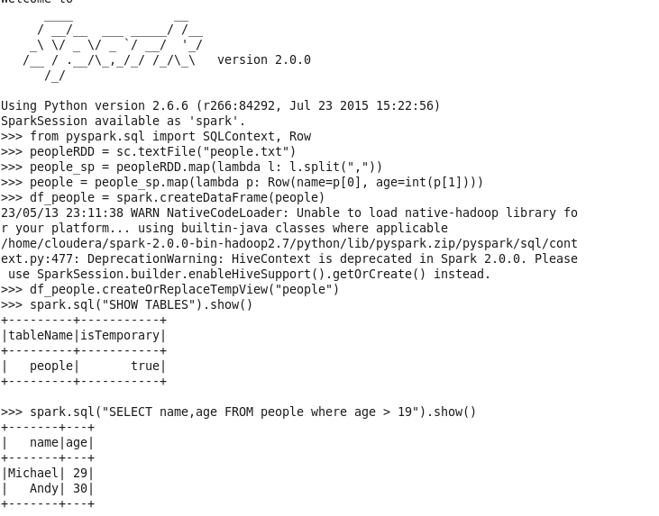
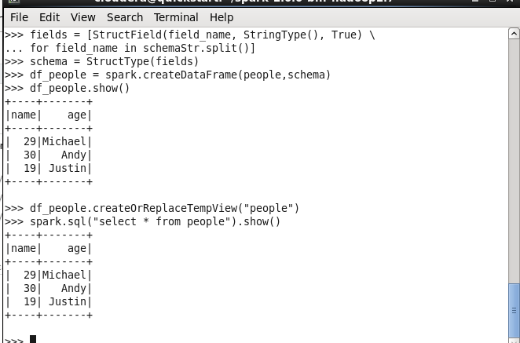

# Praktikum Chapter 4

1. Metode 1 dan Metode 2, Membuat Dataframe dengan objek list, dan juga dengan parallelizing list dan konversi RDD

    

2. Metode 3, Read data from a file, Infer schema and convert to DataFrame

    
    

3. Metode 4: Membaca data dari file, lalu assign schema secara programmatically

    

# Tugas Praktikum

Nama : Yudas Malabi

Kelas : TI 3C / 20

NIM : 2041720054

1. Kode 1
    * mylist & myschema : merupakan list, array / data awal yang digunakan untuk membuat dataframe
2. Kode 2
    * spark.createDataFrame : Membuat DataFrame dari RDD, daftar, atau pandas.DataFrame.
3. Kode 3
    * parallelize : kumpulan list untuk membentuk RDD.
    * toDF : Mengubah Dataset menjadi DataFrame dengan kolom baru.

4. Kode 4
    * hadoop : platform perangkat lunak yang memungkinkan pengolahan data secara terdistribusi pada cluster besar yang terdiri dari ribuan node dan kapasitas data mencapai petabyte.
    * fs :  menyediakan akses ke berbagai sistem file termasuk Hadoop Distributed File System (HDFS) dan sistem file lokal.
    * put : sebuah operasi untuk mengunggah file atau objek dari mesin lokal atau virtual ke sistem penyimpanan objek pada PySpark.
5. Kode 5
    * pyspark.sql : Mengembalikan DataFrame yang mewakili hasil kueri yang diberikan.
    * SQLContext : membuat DataFrame, mendaftarkan DataFrame sebagai tabel, mengeksekusi SQL, dll.
    * createOrReplaceTempView : Membuat atau mengganti tampilan sementara lokal dengan DataFrame ini.
    * show : Mencetak n baris pertama ke konsol.
6. Kode 6
    * textFile : Baca file teks dari HDFS.
    * map : Kembalikan RDD baru dengan menerapkan fungsi ke setiap elemen RDD ini.
    * lambda : untuk fungsi sederhana yang dapat ditulis sebagai ekspresi
    * strip : menghapus karakter awal dan akhir dari sebuah string, termasuk spasi putih atau sekumpulan karakter tertentu
    * StructField :  representasi dari sebuah field di StructType
    * StringType : tipe data pada PySpark yang digunakan untuk merepresentasikan nilai string
7. Kode 7
    * spark.read.format : membaca data dari berbagai sumber data seperti file CSV, JSON, Parquet, Avro, dan lain-lain
    * jdbc :  modul yang tersedia di Apache Spark yang digunakan untuk membaca dan menulis data dari database menggunakan JDBC (Java Database Connectivity)
    * options : menentukan opsi konfigurasi saat membaca atau menulis data dari atau ke sumber eksternal.
    * load : memuat data ke dalam DataFrame dengan format tertentu, seperti CSV, JSON, parquet, atau ORC
8. Kode 8
    * show : menampilkan data dari DataFrame
9. Kode 9
    * collect : mengambil seluruh data dari DataFrame ke dalam bentuk Python list
    * rdd : kumpulan data yang terdistribusi di seluruh node dalam sebuah cluster, yang dapat diproses secara terpisah dan paralel.
    * take : mengambil sejumlah baris dari sebuah RDD atau DataFrame dan mengembalikan hasilnya ke driver node dalam bentuk Python list
10. Kode 10
    * makeRDD : membuat RDD baru dari data yang sudah ada di dalam memori.
    * Seq : tipe data di Scala yang merepresentasikan sebuah urutan dari elemen-elemen yang dapat diakses secara berurutan.
    * createDataset : membuat sebuah Dataset, yaitu sebuah struktur data yang mirip dengan DataFrame, tetapi memiliki tipe data yang terjaga (strongly-typed) dan mendukung pemrograman fungsional
11. Kode 11
    * filter : melakukan filtering (penyaringan) pada sebuah Dataset atau DataFrame dengan kriteria tertentu
12. Kode 12
    * as : memberikan alias (nama lain) pada sebuah kolom dalam sebuah DataFrame atau Dataset
    * toDF : mengubah sebuah RDD (Resilient Distributed Dataset) menjadi sebuah DataFrame
    * first : mengembalikan elemen pertama dari RDD
13. Kode 13
    * listDatabases : Mengembalikan daftar database yang tersedia di semua sesi.
    * listTables : Mengembalikan daftar tabel/tampilan dalam database yang ditentukan.
    * listFunctions : Mengembalikan daftar fungsi yang terdaftar di database yang ditentukan.
    * isCached : Mengembalikan nilai true jika tabel saat ini di-cache dalam memori.
    * select : Memproyeksikan sekumpulan ekspresi dan mengembalikan DataFrame baru.
14. Kode 14
    * Read : menyesuaikan cara data dibaca dari source data
    * text : membaca file teks ke dalam DataFrame
15. Kode 15
    * load : Memuat data dari source data dan mengembalikannya sebagai DataFrame.
    * json : membaca file JSON ke dalam Spark DataFrame
    * format : load sebuah file / memformat hasil file dengan tipe data tertentu
    * printSchema : Mencetak skema dataframe dalam format tree.
16. Kode 16
    * write : untuk menyimpan konten DataFrame non-streaming ke penyimpanan eksternal.
    * save : untuk menyimpan konten DataFrame ke sumber data.
17. Kode 17
    * parquet : Menyimpan konten DataFrame dalam format Parket pada path yang ditentukan.
18. Kode 18
    * Options : menyesuaikan / memberikan opsi bagaimana data dibaca dari sumbernya.
    * inferSchema : alternatif dari fungsi schema sebagai penyesuaian tipe data dari kolom pada file csv dengan lebih cepat.
    * csv : Memuat file CSV dan mengembalikan hasilnya sebagai DataFrame.
    * header : opsi jika file csv memiliki header, maka baris pertama akan digunakan sebagai nama kolom.
    * codec: Opsi ini digunakan untuk menentukan codec kompresi yang akan digunakan saat pada output. contoh codec yang disupport adalah gzip, snappy, dan bzip2.